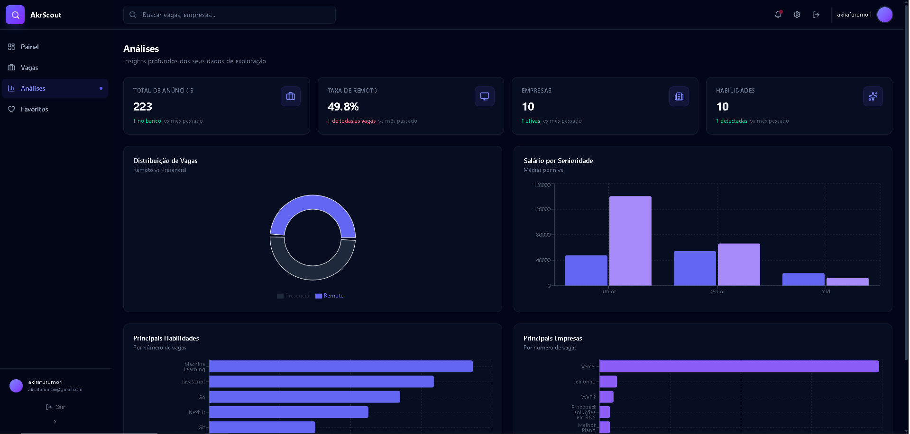

# Guia de Produção — AKR Scout

> Documento oficial de deployment e publicação.
> Siga cada etapa na ordem para colocar o projeto no ar profissionalmente.

---

## Índice

1. [GitHub — Subir o Código](#1-github--subir-o-código)
2. [Supabase — Configurar Banco de Dados](#2-supabase--configurar-banco-de-dados)
3. [Frontend — Variáveis de Ambiente](#3-frontend--variáveis-de-ambiente)
4. [Python — Variáveis de Ambiente e Execução](#4-python--variáveis-de-ambiente-e-execução)
5. [Executar o Scraper Manualmente](#5-executar-o-scraper-manualmente)
6. [Vercel — Fazer Deploy do Frontend](#6-vercel--fazer-deploy-do-frontend)
7. [GitHub Actions — Automatizar o Scraper](#7-github-actions--automatizar-o-scraper)
8. [Testes Finais — Checklist](#8-testes-finais--checklist)
9. [Screenshots — Capturar Telas](#9-screenshots--capturar-telas)
10. [README — Atualizar com Links Reais](#10-readme--atualizar-com-links-reais)
11. [LinkedIn — Publicar e Divulgar](#11-linkedin--publicar-e-divulgar)
12. [Organização Profissional](#12-organização-profissional)

---

## 1. GitHub — Subir o Código

### 1.1 Criar o repositório no GitHub

1. Acesse [github.com/new](https://github.com/new)
2. Preencha:
   - **Repository name**: `akrscout` (ou `AKR-Scout`)
   - **Description**: "AKR Scout — Intelligent Job Scouting Platform. Automated tech job aggregation, real-time market analytics, and data-driven career insights."
   - **Visibility**: `Public`
3. **Não** inicie com README, .gitignore ou license (já temos)
4. Clique **Create repository**

### 1.2 Conectar o repositório local

No terminal, dentro da pasta do projeto:

```bash
# Adiciona a origem remota
git remote add origin https://github.com/SEU_USUARIO/akrscout.git

# Verifica se está correto
git remote -v
# Deve mostrar:
# origin  https://github.com/SEU_USUARIO/akrscout.git (fetch)
# origin  https://github.com/SEU_USUARIO/akrscout.git (push)
```

### 1.3 Fazer commit e push

```bash
# Verifica o estado atual
git status

# Adiciona todos os arquivos
git add .

# Faz o primeiro commit
git commit -m "feat: initial AKR Scout project scaffold

Full-stack job scouting platform with React frontend,
Supabase PostgreSQL, Python scraper, and GitHub Actions CI/CD."

# Envia para o GitHub
git push -u origin main
```

> Se sua branch padrão for `master`, use `git push -u origin master`.

### 1.4 Estrutura final do repositório

Após o push, o repositório no GitHub deve estar assim:

```
akrscout/
├── .github/
│   └── workflows/
│       └── scraper.yml              # Pipeline automatizado
├── frontend/
│   ├── public/
│   │   └── favicon.svg             # Favicon da marca
│   ├── src/
│   │   ├── components/             # Componentes React
│   │   ├── contexts/               # Contextos (Auth, Notifications)
│   │   ├── hooks/                  # Hooks customizados
│   │   ├── lib/                    # Utilitários
│   │   ├── pages/                  # Páginas do app
│   │   ├── routes/                 # Rotas
│   │   ├── services/               # Clientes Supabase/API
│   │   ├── App.jsx
│   │   ├── main.jsx
│   │   └── index.css               # Tailwind + animações
│   ├── .env.example
│   ├── index.html
│   ├── package.json
│   └── vite.config.js
├── python/
│   ├── analytics/                  # Métricas do pipeline
│   ├── config/                     # Configurações
│   ├── parsers/                    # Parsers HTML/skills
│   ├── scrapers/                   # Scrapers (RemoteOK)
│   ├── services/                   # DatabaseService
│   ├── utils/                      # Logger, normalizer
│   ├── .env.example
│   ├── AUTOMATION.md              # Documentação da automação
│   ├── main.py                    # Pipeline principal
│   └── requirements.txt
├── screenshots/                    # Placeholders de screenshots
├── supabase/
│   └── schema.sql                 # Schema completo do banco
├── .gitignore
├── DEPLOY_PRODUCTION.md           # Este guia
└── README.md                      # README profissional
```

---

## 2. Supabase — Configurar Banco de Dados

### 2.1 Criar projeto no Supabase

1. Acesse [supabase.com](https://supabase.com)
2. Faça login (ou crie conta gratuita)
3. Clique **New project**
4. Preencha:
   - **Name**: `akrscout`
   - **Database Password**: escolha uma senha forte (guarde!)
   - **Region**: escolha a mais próxima (ex: `South America (São Paulo)`)
   - **Pricing Plan**: Free tier é suficiente
5. Clique **Create new project**
6. Aguarde ~2 minutos enquanto o banco é provisionado

### 2.2 Obter as credenciais

Após criar o projeto, vá para **Project Settings** (ícone de engrenagem):

#### Project URL
- Settings → **API** → **Project URL**
- Exemplo: `https://abcdefghijklm.supabase.co`
- **Guarde este valor** — será `SUPABASE_URL`

#### Anon Key
- Settings → **API** → **Project API keys** → **anon public**
- Exemplo: `eyJhbGciOiJIUzI1NiIsInR5cCI6IkpXVCJ9...`
- **Guarde este valor** — será `SUPABASE_ANON_KEY`

#### Service Role Key
- Settings → **API** → **Project API keys** → **service_role** (segredo!)
- Exemplo: `eyJhbGciOiJIUzI1NiIsInR5cCI6IkpXVCJ9...`
- **Guarde este valor** — será `SUPABASE_SERVICE_KEY`
- ⚠️ **Nunca compartilhe esta chave** — ela tem acesso total ao banco

### 2.3 Executar o Schema SQL

1. No Supabase, vá para **SQL Editor**
2. Clique **New query**
3. Abra o arquivo local `supabase/schema.sql`
4. Copie TODO o conteúdo (651+ linhas)
5. Cole no SQL Editor
6. Clique **Run** (▶️)
7. Aguarde todas as queries executarem (deve levar <5 segundos)

### 2.4 Validar a instalação

Vá para **Table Editor** e confirme se as tabelas existem:

- ✅ `companies`
- ✅ `skills`
- ✅ `jobs`
- ✅ `job_skills`
- ✅ `favorites`
- ✅ `analytics_snapshots`

Depois vá em **Database** → **Functions** e confirme:

- ✅ `fn_generate_job_hash`
- ✅ `fn_toggle_favorite`
- ✅ `fn_upsert_job`
- ✅ `fn_set_job_skills`

E em **Database** → **Views**:

- ✅ `vw_jobs`
- ✅ `vw_recent_jobs`
- ✅ `vw_top_skills`
- ✅ `vw_top_companies`
- ✅ `vw_remote_stats`
- ✅ `vw_salary_by_seniority`

### 2.5 Verificar Row-Level Security

Em **Authentication** → **Policies**, confirme que as políticas RLS estão ativas para:

- `favorites` — autenticados podem CRUD apenas seus próprios registros
- `jobs` — leitura pública permitida
- `companies` — leitura pública permitida
- `skills` — leitura pública permitida

---

## 3. Frontend — Variáveis de Ambiente

### 3.1 Criar arquivo .env

No diretório `frontend/`, crie o arquivo `.env`:

```bash
cd frontend
cp .env.example .env
```

### 3.2 Conteúdo do .env

Edite `frontend/.env` com suas credenciais reais:

```env
VITE_SUPABASE_URL=https://abcdefghijklm.supabase.co
VITE_SUPABASE_ANON_KEY=eyJhbGciOiJIUzI1NiIsInR5cCI6IkpXVCJ9...
```

> ⚠️ **Nunca comite este arquivo.** O `.env` já está no `.gitignore`.

### 3.3 Testar o frontend localmente

```bash
cd frontend
npm install
npm run dev
```

Acesse `http://localhost:5173`. Se estiver logado, verá o dashboard com dados. Se não, crie uma conta.

---

## 4. Python — Variáveis de Ambiente e Execução

### 4.1 Criar ambiente virtual

```bash
cd python
python3 -m venv venv
source venv/bin/activate   # Linux/macOS
# ou: venv\Scripts\activate  # Windows
```

### 4.2 Instalar dependências

```bash
pip install --upgrade pip
pip install -r requirements.txt
```

### 4.3 Instalar Playwright Chromium

```bash
playwright install chromium
playwright install-deps chromium   # Linux apenas
```

### 4.4 Configurar .env

```bash
cp .env.example .env
```

Edite `python/.env`:

```env
SUPABASE_URL=https://abcdefghijklm.supabase.co
SUPABASE_SERVICE_KEY=eyJhbGciOiJIUzI1NiIsInR5cCI6IkpXVCJ9...
```

> Use a **service_role key** (não a anon key).

---

## 5. Executar o Scraper Manualmente

### 5.1 Comando

```bash
cd python
source venv/bin/activate
python main.py
```

### 5.2 Saída esperada

```
09:00:00 | INFO     | ========================================================
09:00:00 | INFO     |   AKR Scout — Job Ingestion Pipeline
09:00:00 | INFO     | ========================================================
09:00:00 | INFO     | Supabase connection OK
09:00:01 | INFO     | Scraping source: RemoteOK
09:00:05 | INFO     | Inserted 47 jobs from RemoteOK
09:00:05 | INFO     | --------------------------------------------------------
09:00:05 | INFO     |   Pipeline Summary
09:00:05 | INFO     |   Found:     50
09:00:05 | INFO     |   Inserted:  47
09:00:05 | INFO     |   Skipped:   3
09:00:05 | INFO     |   Errors:    0
09:00:05 | INFO     |   Duration:  5.23s
09:00:05 | INFO     | ========================================================
```

### 5.3 Validar no Supabase

1. Vá para **Table Editor** → `jobs`
2. Confirme que as vagas estão aparecendo
3. Vá para **Table Editor** → `skills`
4. Confirme que as skills foram populadas

Você também pode testar no SQL Editor:

```sql
SELECT COUNT(*) FROM jobs;
SELECT COUNT(*) FROM skills;
SELECT * FROM vw_remote_stats;
```

### 5.4 Ver logs

```bash
cat python/logs/pipeline.log
```

---

## 6. Vercel — Fazer Deploy do Frontend

### 6.1 Conectar ao GitHub

1. Acesse [vercel.com](https://vercel.com)
2. Faça login (recomendo com GitHub)
3. Clique **Add New** → **Project**

### 6.2 Importar repositório

1. Encontre `akrscout` na lista (ou clique **Adjust GitHub App Permissions** se não aparecer)
2. Clique **Import**

### 6.3 Configurar o projeto

| Configuração | Valor |
|-------------|-------|
| **Directory** | `frontend` |
| **Framework Preset** | Vite |
| **Build Command** | `npm run build` |
| **Output Directory** | `dist` |

### 6.4 Adicionar variáveis de ambiente

Clique em **Environment Variables** e adicione:

| Name | Value |
|------|-------|
| `VITE_SUPABASE_URL` | `https://abcdefghijklm.supabase.co` |
| `VITE_SUPABASE_ANON_KEY` | `eyJhbGciOiJIUzI1NiIsInR5cCI6IkpXVCJ9...` |

### 6.5 Deploy

1. Clique **Deploy**
2. Aguarde ~1-2 minutos
3. **Pronto!** A Vercel vai gerar uma URL como:
   ```
   https://akrscout.vercel.app
   ```
4. Clique **Visit** para abrir o site

### 6.6 Configurar domínio personalizado (opcional)

1. No dashboard do projeto na Vercel, vá em **Settings** → **Domains**
2. Adicione seu domínio (ex: `akrscout.com.br`)
3. Siga as instruções de DNS

---

## 7. GitHub Actions — Automatizar o Scraper

### 7.1 Configurar GitHub Secrets

1. Vá para seu repositório no GitHub
2. **Settings** → **Secrets and variables** → **Actions**
3. Clique **New repository secret** para cada um:

**Primeiro secret:**
- **Name**: `SUPABASE_URL`
- **Secret**: `https://abcdefghijklm.supabase.co`
- Clique **Add secret**

**Segundo secret:**
- **Name**: `SUPABASE_SERVICE_KEY`
- **Secret**: `eyJhbGciOiJIUzI1NiIsInR5cCI6IkpXVCJ9...`
- Clique **Add secret**

### 7.2 Ativar workflow

O arquivo `.github/workflows/scraper.yml` já está no repositório. O GitHub Actions detecta automaticamente.

1. Vá para a aba **Actions** do repositório
2. Você verá **AKR Scout — Scraper Pipeline** na sidebar
3. O workflow está ativo e agendado para rodar diariamente às 06:00 UTC

### 7.3 Rodar manualmente pela primeira vez

1. Na aba **Actions**, clique em **AKR Scout — Scraper Pipeline**
2. Clique **Run workflow** (botão azul à direita)
3. Deixe `INFO` como log level
4. Clique **Run workflow**
5. Aguarde a execução (~2-3 minutos)
6. Clique na execução para ver os logs em tempo real

### 7.4 Validar logs do workflow

Na página da execução, você verá:

- ✅ **Checkout code** — código baixado
- ✅ **Setup Python** — Python 3.12 instalado
- ✅ **Install dependencies** — pip install
- ✅ **Install Playwright Chromium** — navegador instalado
- ✅ **Create .env file** — secrets injetados
- ✅ **Run scraper pipeline** — `python main.py` executado
- ✅ **Upload pipeline logs** — logs salvos como artifact
- ✅ **Pipeline summary** — resumo no final

Role até o final para ver o **Pipeline summary**:

```
## AKR Scout — Scraper Pipeline Summary

| Metric    | Value         |
|-----------|---------------|
| Status    | success       |
| Trigger   | workflow_dispatch |
| Date      | 2026-05-17 10:00 UTC |
| Run ID    | 1234567890    |

### Log Preview (last 30 lines)
[HORA] | INFO | Pipeline Summary
```

### 7.5 Verificar agendamento automático

O workflow roda automaticamente:
- Todos os dias às **06:00 UTC** (03:00 Brasília)
- O horário é configurado no cron: `"0 6 * * *"`
- Para mudar, edite `.github/workflows/scraper.yml` linha 20

---

## 8. Testes Finais — Checklist

Marque cada item após verificar:

### Autenticação
- [ ] Acessar `https://akrscout.vercel.app`
- [ ] Clicar **Get Started** ou **Sign In**
- [ ] Criar conta com email e senha
- [ ] Confirmar email (se necessário)
- [ ] Fazer login
- [ ] Fazer login com Google
- [ ] Fazer login com GitHub
- [ ] Fazer logout
- [ ] Tentar acessar `/dashboard` sem login → redireciona para `/login`

### Dashboard
- [ ] Logado, ver página inicial `/dashboard`
- [ ] Cards de estatísticas aparecem (Total Jobs, Remote, Companies, Skills)
- [ ] Gráfico "Top Skills in Demand" aparece
- [ ] Gráfico "Companies Hiring" aparece
- [ ] Seção "Market Overview" aparece
- [ ] Dados são reais (conectados ao Supabase)

### Jobs
- [ ] Navegar para `/jobs`
- [ ] Lista de vagas aparece
- [ ] Pesquisar por título funciona
- [ ] Filtros (Remote, Seniority, Employment Type) funcionam
- [ ] Paginação funciona
- [ ] Clicar coração ao lado de uma vaga → favorita
- [ ] Clicar coração novamente → desfavorita
- [ ] Link externo da vaga abre em nova aba

### Analytics
- [ ] Navegar para `/analytics`
- [ ] Gráfico de pizza "Job Distribution" aparece
- [ ] Gráfico "Salary by Seniority" aparece
- [ ] Gráfico "Top Skills" aparece
- [ ] Gráfico "Top Companies" aparece
- [ ] Todos os cards de estatísticas carregam

### Favoritos
- [ ] Navegar para `/favorites`
- [ ] Vagas favoritadas aparecem na lista
- [ ] Data de quando foi salvo aparece
- [ ] Remover favorito funciona
- [ ] Lista vazia mostra estado vazio

### Experiência Mobile
- [ ] Abrir o site no celular ou redimensionar navegador
- [ ] Sidebar colapsa em menu hamburger
- [ ] Navegação funciona no mobile
- [ ] Layout adapta para tela pequena

### Scraper Manual (opcional)
- [ ] `cd python && python main.py` executa sem erros
- [ ] Logs mostram "Pipeline Summary"
- [ ] Novas vagas aparecem no Supabase após execução

### GitHub Actions
- [ ] Workflow aparece na aba Actions
- [ ] Execução manual completa com sucesso
- [ ] Logs da pipeline estão disponíveis
- [ ] Secrets configurados corretamente

### Performance
- [ ] Páginas carregam em <3 segundos
- [ ] Loading skeletons aparecem enquanto carrega
- [ ] Transições são suaves

---

## 9. Screenshots — Capturar Telas

### 9.1 Ferramentas recomendadas

| Ferramenta | Uso |
|-----------|-----|
| [CleanShot](https://cleanshot.com) (macOS) | Capturas profissionais |
| [ShareX](https://getsharex.com) (Windows) | Gratuito e completo |
| [Flameshot](https://flameshot.org) (Linux) | Open-source |
| Extensão Chrome **GoFullPage** | Captura de página inteira |

### 9.2 Telas para capturar

Abra cada página no navegador e capture:

| Arquivo | Tela | Dicas |
|---------|------|-------|
| `dashboard.png` | Dashboard completo | Mostre os 4 cards + 2 gráficos + Market Overview |
| `analytics.png` | Analytics | Mostre o donut + salary bars + top skills + companies |
| `jobs.png` | Jobs com resultados | Tenha filtros ativos, mostre resultados reais |
| `favorites.png` | Favoritos | Pelo menos 2-3 vagas salvas |
| `login.png` | Tela de login | Sidebar do AuthLayout visível |
| `mobile.png` | Dashboard no mobile | Use DevTools (F12) modo responsivo, 375px width |

### 9.3 Dicas para screenshots profissionais

- **Mantenha o tema escuro** — mais premium
- **Use dados reais** — mostre números reais do scraping
- **Limpe o ambiente** — feche abas desnecessárias
- **Resolução**: 1440x900 ou superior para desktop
- **Formato**: PNG (qualidade) ou WebP (tamanho)
- **Nomeie**: tudo minúsculo, sem espaços, no formato `nome.svg`
- **Salve em**: `screenshots/` na raiz do projeto

### 9.4 Atualizar screenshots no README

Depois de capturar, substitua os placeholders SVG pelos PNGs reais:

```markdown
<!-- Antes (placeholder) -->


<!-- Depois (real) -->

```

### 9.5 Fazer commit das screenshots

```bash
git add screenshots/
git commit -m "docs: add production screenshots"
git push
```

---

## 10. README — Atualizar com Links Reais

### 10.1 Badges

Substitua os placeholders pelos links reais do seu projeto:

```markdown
<!-- GitHub Actions status -->


<!-- GitHub repo -->

```

### 10.2 Deploy URL

No badge da Vercel, adicione o link real:

```markdown
<a href="https://akrscout.vercel.app">
  
</a>
```

### 10.3 GitHub URL

No badge "Status" e no início do README:

```markdown
<a href="https://github.com/SEU_USUARIO/akrscout">
```

### 10.4 Comitar alterações

```bash
git add README.md
git commit -m "docs: update README with production URLs"
git push
```

---

## 11. LinkedIn — Publicar e Divulgar

### 11.1 Modelo de post técnico (inglês — maior alcance)

> 💡 **Dica**: Publique em inglês para alcançar recrutadores globais. Se preferir português, use o segundo modelo.

```
🚀 I just shipped AKR Scout — a full-stack SaaS that automatically scrapes, analyzes, and surfaces tech job opportunities.

What it does:
• Automated daily scraping of 50+ tech job listings
• Real-time market analytics (salary trends, skill demand)
• Smart filtering, search, and personalized favorites
• Premium React dashboard with Supabase PostgreSQL

The stack:
• React 19 + Vite 8 + Tailwind CSS v4
• Supabase (PostgreSQL, Auth, RLS)
• Python + Playwright (scraping pipeline)
• GitHub Actions (automated daily CI/CD)
• Deployed on Vercel

Engineering highlights:
• Clean modular architecture with reusable hooks
• Content-hash deduplication for job listings
• Row-Level Security for multi-user data isolation
• 40+ skill keyword extraction and market trend analysis
• Production-grade GitHub Actions pipeline with log artifacts

This was built as a portfolio project to demonstrate full-stack SaaS engineering — from database design to CI/CD automation.

🔗 Live: https://akrscout.vercel.app
📂 Code: https://github.com/SEU_USUARIO/akrscout

#React #Supabase #Python #SaaS #FullStack #DevOps #GitHubActions #WebScraping #Playwright #PostgreSQL
```

### 11.2 Modelo de post em português

```
🚀 Finalmente coloquei no ar o AKR Scout — uma plataforma SaaS completa de scouting de vagas de tecnologia.

O que faz:
• Scraping automático diário de vagas tech
• Analytics de mercado em tempo real (salários, skills, empresas)
• Filtros inteligentes, busca e favoritos personalizados
• Dashboard premium construído com React + Supabase

Stack:
• React 19 / Vite 8 / Tailwind CSS v4
• Supabase PostgreSQL com Row-Level Security
• Python + Playwright para scraping
• GitHub Actions para automação CI/CD
• Deploy na Vercel

Destaques técnicos:
• Arquitetura modular com hooks reutilizáveis
• Deduplicação por hash de conteúdo
• Extração de 40+ skills tech
• Pipeline automatizado com logs e artifacts
• Design responsivo mobile-first

🔗 Live: https://akrscout.vercel.app
📂 Código: https://github.com/SEU_USUARIO/akrscout

#React #Supabase #Python #SaaS #FullStack #DevOps #GitHubActions
```

### 11.3 Hashtags recomendadas

```
#React #Supabase #Python #SaaS #FullStack #DevOps
#GitHubActions #WebScraping #Playwright #PostgreSQL
#Vite #TailwindCSS #SoftwareEngineering #OpenSource
#TechJobs #CareerDevelopment #Portfolio
```

### 11.4 Quando publicar

| Dia | Horário (Brasília) | Motivo |
|-----|-------------------|--------|
| Segunda | 08:00-10:00 | Início da semana, recrutadores ativos |
| Terça | 12:00-13:00 | Pausa do almoço |
| Quarta | 18:00-19:00 | Final do expediente |
| Quinta | 08:00-10:00 | Alta atividade |

### 11.5 Engajamento

Após publicar:

1. **Marque amigos** da área de tecnologia nos comentários
2. **Responda** todos os comentários
3. **Compartilhe** em grupos de tecnologia no WhatsApp/Telegram/Discord
4. **Adicione** o link do projeto no topo do seu perfil do LinkedIn (seção "Featured")

---

## 12. Organização Profissional

### 12.1 Padrão de commits

Use commits semânticos para manter o histórico limpo:

```
feat:     nova funcionalidade
fix:      correção de bug
docs:     documentação
style:    formatação, espaçamento
refactor: refatoração de código
test:     testes
chore:    tarefas de build/CI
```

Exemplos:
```
feat: add salary range filter to job search
fix: resolve pagination reset on filter change
docs: update README with deployment guide
refactor: extract sidebar into reusable component
chore: configure GitHub Actions caching
```

### 12.2 Mantendo o GitHub organizado

- ✅ **README** atualizado com links reais
- ✅ **Screenshots** reais (não placeholders)
- ✅ **Badges** funcionando
- ✅ **Descrição do repositório** preenchida
- ✅ **Topics** configurados (Settings → Tags):
  - `react`, `supabase`, `python`, `tailwind-css`, `vercel`
  - `saas`, `web-scraping`, `playwright`, `postgresql`
  - `github-actions`, `full-stack`, `portfolio`
- ✅ **Website** link apontando para a Vercel
- ✅ **License** configurada (MIT)

### 12.3 Apresentando em entrevistas

Quando falar sobre o AKR Scout em entrevistas, destaque:

**Para recrutadores (não-técnicos):**
> "Criei uma plataforma que monitora automaticamente milhares de vagas de tecnologia, extrai skills e salários, e apresenta tudo num dashboard profissional. Usei React, Python e banco de dados na nuvem."

**Para tech leads/engenheiros:**
> "O AKR Scout é um SaaS full-stack com pipeline de scraping em Python (Playwright + BeautifulSoup), banco PostgreSQL com views agregadas e RLS, frontend React 19 com hooks customizados e CI/CD via GitHub Actions. A arquitetura separa scraper, serviços, hooks e componentes em camadas bem definidas."

**Tópicos para mencionar:**
- Decisões de arquitetura (por que Supabase e não Firebase?)
- Segurança (RLS, service_role vs anon key)
- Performance (memoização, debounce, skeletons)
- CI/CD (automação diária, artifacts, secrets)
- UX (design responsivo, notificações, estados de loading/empty/error)

### 12.4 Checklist final pré-publicação

- [ ] README com badges funcionando
- [ ] Repositório com descrição e topics
- [ ] Screenshots reais substituindo placeholders
- [ ] Deploy na Vercel funcionando
- [ ] GitHub Actions executando sem erros
- [ ] Secrets configurados no GitHub
- [ ] LinkedIn post programado
- [ ] Link do projeto no perfil do LinkedIn
- [ ] Código limpo sem `.env` ou secrets

---

## Parabéns! 🚀

O AKR Scout está oficialmente em produção.

Você construiu:
- ✅ Um SaaS full-stack completo
- ✅ Com scraping automatizado
- ✅ Analytics em tempo real
- ✅ CI/CD profissional
- ✅ Deploy na nuvem
- ✅ Código aberto e documentado

Agora é só divulgar e colher os frutos. Boa sorte!

---

<div align="center">
  <sub>
    <strong>Desenvolvido por Bruno Akira Furumori</strong>
    <br/>
    <a href="https://github.com/anomalyco">GitHub</a> ·
    <a href="https://linkedin.com/in/bruno-akira-furumori">LinkedIn</a>
    <br/>
    <br/>
    <sub>© 2026 AKR Scout</sub>
  </sub>
</div>
