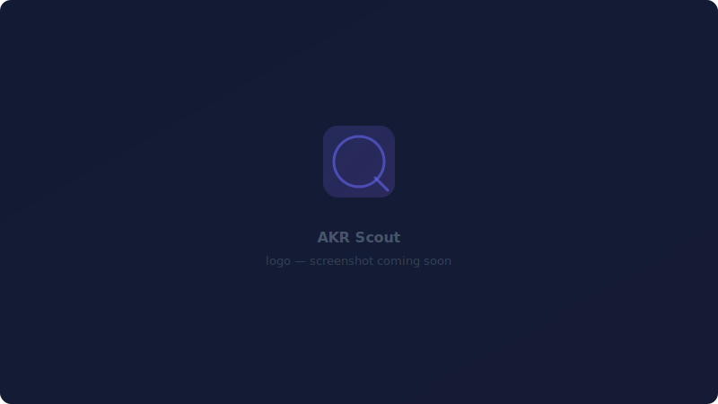
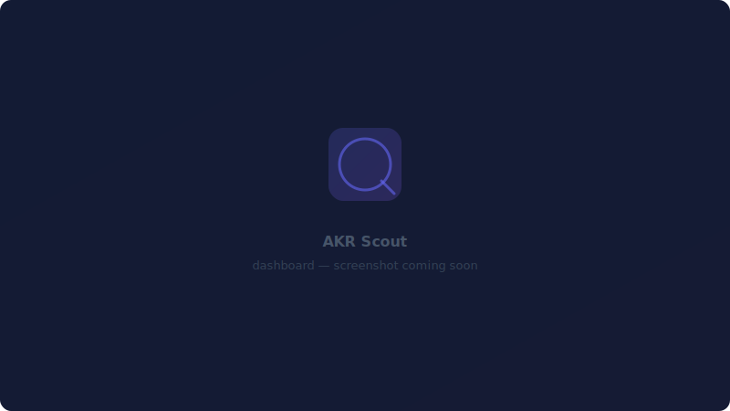
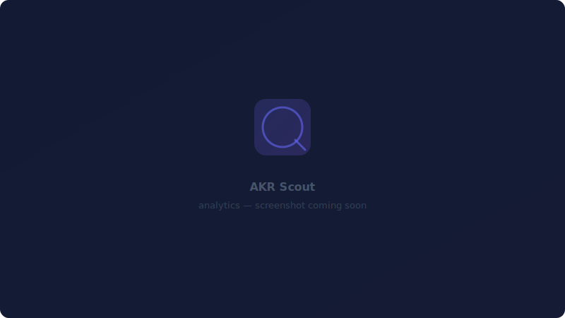

<div align="center">
  <br/>
  
  <br/>
  <h1>AkrScout</h1>
  <h3>Plataforma inteligente de busca de vagas de tecnologia</h3>
  <br/>

  <p>
    Automação de vagas tech · Analytics em tempo real · Insights de carreira baseados em dados
  </p>

  <br/>

  <!-- Badges -->
  <a href="https://github.com/BrunoAkiraSenai/akrscout/actions">
    
  </a>
  <a href="https://github.com/BrunoAkiraSenai/akrscout">
    
  </a>
  <a href="LICENSE">
    
  </a>
  <a href="https://react.dev">
    
  </a>
  <a href="https://supabase.com">
    
  </a>
  <a href="https://tailwindcss.com">
    
  </a>
  <a href="https://python.org">
    
  </a>
  <a href="https://playwright.dev">
    
  </a>
  <a href="https://vercel.com">
    
  </a>
  <a href="https://github.com/features/actions">
    
  </a>

  <br/>
  <br/>

  <!-- Screenshots Row -->
  <table>
    <tr>
      <td></td>
      <td></td>
    </tr>
    <tr>
      <td align="center"><em>Dashboard — visão geral do mercado em tempo real</em></td>
      <td align="center"><em>Analytics — skills, salários e tendências</em></td>
    </tr>
    <tr>
      <td></td>
      <td></td>
    </tr>
    <tr>
      <td align="center"><em>Jobs — busca, filtros e scouting</em></td>
      <td align="center"><em>Favorites — salve e acompanhe vagas</em></td>
    </tr>
  </table>

  <br/>
  <sub><strong>Desenvolvido por <a href="https://github.com/anomalyco">Bruno Akira Furumori</a></strong></sub>
  <br/>
  <sub>Scouting de vagas tech · Inteligência de mercado · Analytics de carreira</sub>
  <br/>
  <br/>
</div>

---

## Visão Geral

O AkrScout é uma plataforma SaaS full-stack que agrega, analisa e exibe oportunidades de emprego em tecnologia de forma automatizada. Combina web scraping com analytics em tempo real para fornecer inteligência de carreira baseada em dados.

A plataforma coleta vagas de tech diariamente, normaliza os anúncios, extrai skills e apresenta tudo através de um dashboard React. Construída com arquitetura modular e CI/CD de produção.

### Por que AkrScout?

- **Automático** — Vagas coletadas diariamente, sem esforço manual
- **Data-driven** — Analytics revelam tendências salariais, demanda por skills e mudanças no mercado
- **Stack moderna** — React 19, Supabase, Python, arquitetura serverless
- **Pronto para produção** — CI/CD, RLS, pipelines automatizados, deploy Vercel

---

## Funcionalidades

<table>
  <tr>
    <td width="50%">
      <h3>🤖 Scraping Automatizado</h3>
      <p>Pipeline diário com Playwright + BeautifulSoup. Deduplicação via content hashing. Extração estruturada com parsing de skills.</p>
    </td>
    <td width="50%">
      <h3>📊 Analytics em Tempo Real</h3>
      <p>Visão geral do mercado, salário por senioridade, top skills, ranking de empresas, distribuição remoto vs presencial. Tudo com aggregate views do PostgreSQL.</p>
    </td>
  </tr>
  <tr>
    <td width="50%">
      <h3>🔐 Autenticação</h3>
      <p>Supabase Auth com email/senha. Row-Level Security garante isolamento de dados por usuário.</p>
    </td>
    <td width="50%">
      <h3>⭐ Favoritos Inteligentes</h3>
      <p>Salve vagas com um clique. UI com atualização otimista. Sincroniza com o banco para acesso persistente entre sessões.</p>
    </td>
  </tr>
  <tr>
    <td width="50%">
      <h3>🔍 Filtros Inteligentes</h3>
      <p>Busca por título ou empresa. Filtros por remoto, senioridade, tipo de contrato. Busca com debounce e paginação.</p>
    </td>
    <td width="50%">
      <h3>📱 Design Responsivo</h3>
      <p>Sidebar mobile-first, layouts adaptáveis, controles touch-friendly. Tema escuro premium com Tailwind CSS v4.</p>
    </td>
  </tr>
  <tr>
    <td width="50%">
      <h3>🔄 Pipeline CI/CD</h3>
      <p>GitHub Actions executa o scraper diariamente. Instalação automatizada de dependências, setup do Playwright e arquivamento de logs.</p>
    </td>
    <td width="50%">
      <h3>🛡️ Segurança RLS</h3>
      <p>Políticas Row-Level Security em todas as tabelas. Leitura pública para vagas, CRUD autenticado para favoritos, service_role para ingestão.</p>
    </td>
  </tr>
</table>

---

## Arquitetura

```
┌──────────────────────────────────────────────────────────┐
│                   Programathor (fonte)                     │
└────────────────────┬─────────────────────────────────────┘
                     │
                     ▼
┌──────────────────────────────────────────────────────────┐
│              Python Scraper (httpx + JSON-LD)              │
│                                                          │
│  1. Fetch listagem     2. Parse HTML/JSON                 │
│  3. Extrair skills     4. Normalizar dados                │
│  5. Gerar hash         6. Upsert no Supabase              │
└────────────────────┬─────────────────────────────────────┘
                     │
                     ▼
┌──────────────────────────────────────────────────────────┐
│                  Supabase PostgreSQL                       │
│                                                          │
│  ┌──────────┐  ┌──────────┐  ┌──────────┐               │
│  │  jobs    │  │ companies│  │  skills  │               │
│  └──────────┘  └──────────┘  └──────────┘               │
│  ┌──────────┐  ┌──────────┐  ┌──────────┐               │
│  │favorites │  │job_skills│  │snapshots │               │
│  └──────────┘  └──────────┘  └──────────┘               │
│                                                          │
│  Aggregate Views: vw_jobs, vw_top_skills,                │
│  vw_top_companies, vw_remote_stats,                      │
│  vw_salary_by_seniority                                  │
└────────────────────┬─────────────────────────────────────┘
                     │
                     ▼
┌──────────────────────────────────────────────────────────┐
│            React Frontend (Vite + Tailwind)               │
│                                                          │
│  ┌──────────┐  ┌──────────┐  ┌──────────┐               │
│  │ Dashboard│  │  Jobs    │  │Analytics │               │
│  └──────────┘  └──────────┘  └──────────┘               │
│  ┌──────────┐  ┌──────────┐  ┌──────────┐               │
│  │ Favorites│  │   Auth   │  │ Landing  │               │
│  └──────────┘  └──────────┘  └──────────┘               │
└────────────────────┬─────────────────────────────────────┘
                     │
                     ▼
┌──────────────────────────────────────────────────────────┐
│                     Vercel (Deploy)                       │
└──────────────────────────────────────────────────────────┘
```

### Fluxo de Dados

1. **Cron diário** aciona o pipeline do GitHub Actions
2. **Python scraper** usa httpx para buscar listagens de vagas
3. **Parsing HTML/JSON** extrai dados estruturados (título, empresa, salário, local, skills)
4. **Deduplicação** via content hash — anúncios idênticos são ignorados
5. **Upsert no banco** insere novas vagas, vincula skills, gera snapshot de analytics
6. **React app** lê das aggregate views do Supabase (com RLS)
7. **Usuário** navega, busca, filtra e salva vagas

---

## Tech Stack

### Frontend
| Tecnologia | Propósito |
|-----------|-----------|
| [React 19](https://react.dev) | UI library com recursos concorrentes |
| [Vite 8](https://vitejs.dev) | Build tool e dev server |
| [Tailwind CSS v4](https://tailwindcss.com) | Estilização utility-first |
| [React Router v7](https://reactrouter.com) | Roteamento client-side |
| [Recharts](https://recharts.org) | Biblioteca de gráficos |
| [Lucide React](https://lucide.dev) | Biblioteca de ícones |
| [Supabase JS](https://supabase.com) | Database client e auth |

### Backend & Dados
| Tecnologia | Propósito |
|-----------|-----------|
| [Supabase](https://supabase.com) | Backend-as-a-service (PostgreSQL, Auth, RLS) |
| [PostgreSQL](https://postgresql.org) | Banco relacional com aggregate views |
| Row-Level Security | Isolamento de dados por usuário |

### Scraping & Automação
| Tecnologia | Propósito |
|-----------|-----------|
| [Python 3.12](https://python.org) | Linguagem do pipeline de scraping |
| [httpx](https://www.python-httpx.org) | HTTP client assíncrono |
| [BeautifulSoup 4](https://www.crummy.com/software/BeautifulSoup/) | Parsing de HTML |
| [LXML](https://lxml.de) | Processamento rápido de XML/HTML |
| [Supabase Python](https://github.com/supabase-community/supabase-py) | Ingestão no banco |

### DevOps
| Tecnologia | Propósito |
|-----------|-----------|
| [GitHub Actions](https://github.com/features/actions) | CI/CD e scraping agendado |
| [Vercel](https://vercel.com) | Deploy do frontend |
| [python-dotenv](https://github.com/theskumar/python-dotenv) | Configuração de ambiente |

---

## Banco de Dados

O banco é um schema PostgreSQL com 6 tabelas, 6 views e 5 functions.

### Tabelas

| Tabela | Propósito |
|--------|-----------|
| `companies` | Registros normalizados de empresas |
| `skills` | Taxonomia de skills (40+ skills tech) |
| `jobs` | Anúncios de vagas com dedup por content hash |
| `job_skills` | Mapeamento many-to-many vaga-skill |
| `favorites` | Vagas salvas por usuário (com RLS) |
| `analytics_snapshots` | Dados de mercado em série temporal |

### Views

| View | Propósito |
|------|-----------|
| `vw_jobs` | Listagem enriquecida com nome da empresa e skills |
| `vw_recent_jobs` | Vagas dos últimos 7 dias |
| `vw_top_skills` | Ranking de demanda por skill |
| `vw_top_companies` | Frequência de contratação por empresa |
| `vw_remote_stats` | Distribuição remoto vs presencial |
| `vw_salary_by_seniority` | Média salarial por nível de senioridade |

### Functions

- `fn_generate_job_hash` — Hash SHA-256 para deduplicação
- `fn_toggle_favorite` — Add/remove seguro de favoritos
- `fn_upsert_job` — Inserção idempotente de vagas
- `fn_set_job_skills` — Associação em lote de skills

### Segurança

- **Público**: Leitura em `jobs`, `companies`, `skills` (usuários autenticados)
- **Autenticado**: CRUD completo em `favorites` (escopo `auth.uid()`)
- **Service Role**: Escrita total para o pipeline de scraping

---

## Automação

### Pipeline GitHub Actions

O scraper executa automaticamente todo dia às 06:00 UTC via GitHub Actions.

```
┌──────────────────────────────────────────┐
│  Schedule: 0 6 * * * (diário)            │
│  Manual: workflow_dispatch (qualquer hora)│
├──────────────────────────────────────────┤
│  1. Checkout do repositório              │
│  2. Setup Python 3.12 (cache)            │
│  3. Instalar dependências                │
│  4. Instalar Playwright Chromium         │
│  5. Injetar secrets do Supabase          │
│  6. Executar python main.py              │
│  7. Upload de logs como artifact         │
│  8. Postar sumário na página de execução │
└──────────────────────────────────────────┘
```

- **Timeout de 30 minutos** evita execuções infinitas
- **Logs retidos** por 7 dias como artifacts
- **Página de sumário** mostra status, duração e preview dos logs
- **Trigger manual** suporta níveis DEBUG/INFO/WARNING

---

## Screenshots

<table>
  <tr>
    <td></td>
    <td></td>
  </tr>
  <tr>
    <td align="center"><strong>Dashboard</strong> — Visão do mercado com stats, top skills, ranking de empresas</td>
    <td align="center"><strong>Analytics</strong> — Salário por senioridade, remoto vs presencial, tendências de skills</td>
  </tr>
  <tr>
    <td></td>
    <td></td>
  </tr>
  <tr>
    <td align="center"><strong>Jobs</strong> — Busca, filtros por senioridade/remoto, paginação</td>
    <td align="center"><strong>Favorites</strong> — Vagas salvas com acesso rápido</td>
  </tr>
  <tr>
    <td></td>
    <td></td>
  </tr>
  <tr>
    <td align="center"><strong>Autenticação</strong> — Supabase Auth com email/senha</td>
    <td align="center"><strong>Mobile</strong> — Design responsivo com sidebar recolhível</td>
  </tr>
</table>

> Screenshots serão adicionadas conforme o projeto evolui. Arquivos placeholder estão no diretório `screenshots/`.

---

## Começando

### Pré-requisitos

- Node.js 20+
- Python 3.12+
- Um projeto Supabase (plano gratuito funciona)
- Suporte a Playwright browser

### Setup Frontend

```bash
# Clone o repositório
git clone https://github.com/BrunoAkiraSenai/akrscout.git
cd akrscout/frontend

# Instale as dependências
npm install

# Configure as variáveis de ambiente
cp .env.example .env
# Edite .env com suas credenciais do Supabase

# Inicie o servidor de desenvolvimento
npm run dev
```

### Setup Scraper

```bash
cd akrscout/python

# Crie o virtual environment
python -m venv venv
source venv/bin/activate  # ou `venv\Scripts\activate` no Windows

# Instale as dependências
pip install -r requirements.txt

# Configure as variáveis de ambiente
cp .env.example .env
# Edite .env com sua service role key do Supabase

# Execute o scraper
python main.py
```

### Setup Banco de Dados

Execute o schema SQL no seu projeto Supabase:

```bash
# Conecte-se ao SQL editor do Supabase e cole:
# supabase/schema.sql
```

Ou use o Supabase CLI:

```bash
supabase db push
```

---

## Variáveis de Ambiente

### Frontend (`frontend/.env`)

```env
VITE_SUPABASE_URL=https://seu-projeto.supabase.co
VITE_SUPABASE_ANON_KEY=sua-chave-anon-supabase
```

### Python Scraper (`python/.env`)

```env
SUPABASE_URL=https://seu-projeto.supabase.co
SUPABASE_SERVICE_KEY=sua-service-role-key-supabase
```

> **Nunca commite arquivos `.env`.** O repositório inclui templates `.env.example` com valores placeholder. O GitHub Actions injeta secrets em tempo de execução via GitHub Secrets.

---

## Destaques de Engenharia

<details>
<summary><strong>Arquitetura Limpa</strong> — Separação modular de responsabilidades</summary>

<br/>

O frontend segue uma arquitetura em camadas estrita:
- **services/** — Supabase client, abstração de API
- **hooks/** — Custom hooks encapsulam toda a busca de dados (useJobs, useAnalytics, useFavorites)
- **contexts/** — Estado de autenticação, sistema de notificações
- **components/** — Primitivas UI reutilizáveis (StatCard, ChartCard, JobCard, Skeleton)
- **pages/** — Componentes de rota que compõem hooks + components
- **routes/** — Roteamento centralizado com guards de autenticação

Isso torna o código previsível, testável e fácil de navegar.
</details>

<details>
<summary><strong>Pipeline Modular</strong> — Arquitetura extensível de scrapers</summary>

<br/>

O scraper Python usa um padrão de abstract base class:
- **BaseScraper** — ABC definindo o contrato do scraper
- **ProgramathorScraper** — Implementação concreta para o Programathor
- **Parser layer** — Separa o parsing HTML da busca
- **Service layer** — Operações de banco isoladas no DatabaseService
- **Tracker** — Instrumentação e métricas do pipeline

Adicionar uma nova fonte de vagas requer apenas uma nova scraper class implementando `fetch()` e `parse()`.
</details>

<details>
<summary><strong>Hooks Reutilizáveis</strong> — Custom React hooks para acesso a dados</summary>

<br/>

Todas as queries do Supabase são encapsuladas em custom hooks:
- `useJobs()` — Lista paginada com busca, filtros, ordenação
- `useAnalytics()` — Fetches paralelos para todos os dados de gráficos
- `useFavorites()` — UI otimista com cache baseado em Set e sync de favoritos
- `useAuth()` — Gerenciamento de sessão com Supabase Auth
- `useTheme()` — Dark mode com persistência em localStorage
- `useSEO()` — Título dinâmico e meta tags
</details>

<details>
<summary><strong>Banco Escalável</strong> — PostgreSQL com aggregate views</summary>

<br/>

O design do banco prioriza performance de query:
- **Views materializadas** — Agregados pré-join para queries do dashboard
- **Índice de content hash** — Deduplicação O(1) via `fn_generate_job_hash`
- **Políticas RLS** — Segurança em nível de linha sem overhead na aplicação
- **Operações em lote** — `fn_set_job_skills` lida com associações em massa de skills

A camada de views (`vw_*`) abstrai joins complexos para que o frontend consulte estruturas simples e planas.
</details>

<details>
<summary><strong>Frontend Pronto para Produção</strong> — UX premium e performance</summary>

<br/>

- **React 19** com componentes memoizados (`React.memo`, `useCallback`, `useMemo`)
- **Busca com debounce** (300ms) para reduzir volume de queries no Supabase
- **UI otimista** para favoritos — feedback instantâneo, sync assíncrono
- **Skeleton loading** com animação shimmer em todas as páginas
- **Toast notifications** para ações do usuário (favoritos, auth, erros)
- **Error boundaries** com capacidade de retry
- **Design responsivo** — sidebar mobile-first com overlay drawer
- **SEO** — Meta tags dinâmicas, Open Graph, títulos descritivos
</details>

<details>
<summary><strong>CI/CD</strong> — Testes automatizados e deploy</summary>

<br/>

- **GitHub Actions** executa o scraper diariamente às 06:00 UTC
- **Vercel** faz deploy automático do frontend no push para main
- **Artifact logging** retém 7 dias de logs do pipeline
- **Gerenciamento de secrets** via GitHub Secrets (nunca no código)
- **Trigger manual** com seleção de nível de log (DEBUG/INFO/WARNING)
</details>

---

## Roadmap

- [x] Scraping automatizado de vagas
- [x] Dashboard de analytics em tempo real
- [x] Autenticação de usuário e favoritos
- [x] Pipeline CI/CD com automação diária
- [x] Experiência mobile responsiva
- [ ] **Recomendações com IA** — Match de vagas com perfil do usuário
- [ ] **Insights salariais** — Tendências históricas e projeções
- [ ] **Previsão de tendências de skills** — Predição de demanda baseada em ML
- [ ] **Notificações por email** — Digest diário de novas vagas
- [ ] **Scraping multi-fonte** — LinkedIn, Indeed, Wellfound, etc.
- [ ] **Extensão Chrome** — Salve vagas de qualquer site com um clique

---

## Licença

Este projeto está licenciado sob a MIT License — veja o arquivo [LICENSE](LICENSE) para detalhes.

---

<br/>
<div align="center">
  <sub>
    <strong>Desenvolvido por Bruno Akira Furumori</strong>
    <br/>
    <a href="https://github.com/anomalyco">GitHub</a> ·
    <a href="https://linkedin.com/in/bruno-akira-furumori">LinkedIn</a>
    <br/>
    <br/>
    
    <br/>
    <br/>
    
    <br/>
    <sub>© 2026 AkrScout. Plataforma inteligente de busca de vagas.</sub>
  </sub>
</div>
<br/>
